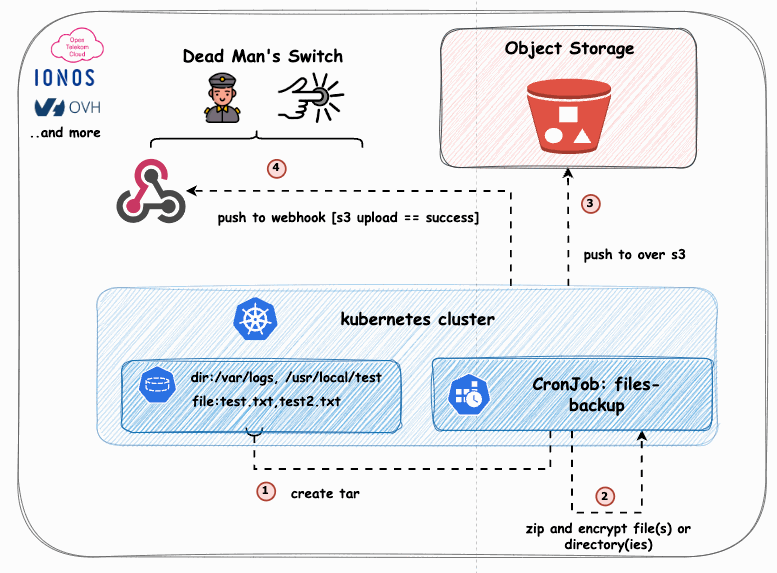

# CronJob: PostgreSQL Backup to S3-Compatible Object Storage with Encryption and Webhook Notification

This README explains how to use the provided Dockerfile and shell script to back up databases to any S3-compatible object storage, with encryption and webhook notifications for each successful upload. But this repo has also a Kubernetes deployment and helm chart for the same purpose.


I've been on the lookout for a tool that caters to a seemingly straightforward use case, yet found none that could:

1. Create a dump of multiple PostgreSQL databases
2. Compress and encrypt this dump on the client side
3. Push it to an object storage endpoint that supports WriteOnceReadMany (WORM) and allows for defined retention times
4. Implement a Dead Man's Switch that trigger a webhook with every successful upload to an S3 bucket

## Preparation Steps

You will need to have the following in place before you can use this tool:

**PostgreSQL:**

- Host: postgresql....
- Port: 20184
- DB Username: avnadmin
- DB User Password: retrieve from Users
- Databases: version-a, version-b....

**S3 Bucket:**

- Your S3 Access Key: ....
- Your S3 Secret Key: ....
- S3-Endpoint: For example, if you're in Germany, it would be https://s3.de.io.cloud.ovh.net/.

**Webhook (optional):**

- Endpoint: https://webhook.site/your-unique-id..

**Encryption Key:**

- A random string of characters that you will use to encrypt the backup files.

## Overview

The Dockerfile builds an image incorporating the necessary tools for database backup, file encryption, and performing webhook notifications. The accompanying shell script executes the following operations:

1. Generates a dump of specified PostgreSQL databases.
2. Encrypts and compresses each dump file using a predefined encryption key.
3. Uploads the encrypted files to an S3-compatible object storage service.
4. Notifies a configured webhook endpoint about each successful upload.

## Requirements

- Docker
- Accessible PostgreSQL databases that should be backed up
- A server or Kubernetes cluster for deploying the CronJob (optional)
- A webhook endpoint for upload notifications

## Configuration

Sensitive details such as database credentials, object storage access keys, and encryption keys should be securely managed. When deployed within a Kubernetes environment, it's advisable to utilize secrets for injecting these values at runtime.

### Environment Variables

- `AWS_S3_ENDPOINT_URL`: Endpoint URL for the S3-compatible object storage.
- `AWS_S3_ACCESS_KEY_ID`: Access key ID with permissions to the object storage bucket.
- `AWS_S3_SECRET_ACCESS_KEY`: Secret access key for the object storage.
- `AWS_S3_BUCKET`: Name of the object storage bucket for storing backups.
- `DATABASE_PASSWORD`: Password for the PostgreSQL database user.
- `DATABASE_USER`: Username for accessing the PostgreSQL database.
- `DATABASE_HOSTNAME`: Hostname of the PostgreSQL database server.
- `DATABASE_NAMES`: Comma-separated list of databases to back up.
- `DATABASE_PORT`: Port for the PostgreSQL database server.
- `WEBHOOK_ENDPOINT`: URL of the webhook to notify upon successful backup upload.
- `ENCRYPTION_KEY`: Key for encrypting backup files.

## Deployment Instructions

1. **Build the Docker Image:**

```sh
docker \
    build . \
    -f build/docker/Dockerfile \
    -t ghcr.io/la-cc/k8s-pg-s3-cronjob:0.0.0
```

2. **Run the Container Locally (For Testing):**

```sh
docker run --env-file .env ghcr.io/la-cc/k8s-pg-s3-cronjob:0.0.0
```

`.env` is a file that contains all necessary environment variables.

3. **Kubernetes Deployment:**

For a Kubernetes deployment, create a `CronJob` resource, along with `Secret` and `ConfigMap` resources, to manage the environment variables and backup schedule.

### Kubernetes Resources

- **Secret**: Stores sensitive information like object storage credentials and database password.
- **ConfigMap**: Manages non-sensitive configuration like database names, ports, and object storage endpoint.
- **CronJob**: Automates the backup process based on a defined schedule.

Consult the Kubernetes documentation to create these resources according to the specified environment variables.

4. **Helm Deployment:**

For a Helm deployment, use the provided Helm chart to deploy the CronJob to your Kubernetes cluster.
You can do it with the following command:

```sh
helm template k8s-pg-s3-cronjob k8s/helm/. | k apply -f -
```

## Security

The Dockerfile configures a non-root user (`backupuser`) to enhance container security. Ensure the Kubernetes `CronJob` specification includes an appropriate `securityContext` to respect this setup.

## Conclusion

This configuration offers a secure, automated way to back up PostgreSQL databases to any S3-compatible object storage service, with notifications upon successful uploads. Customize the setup as needed to align with your specific environment and security protocols.
